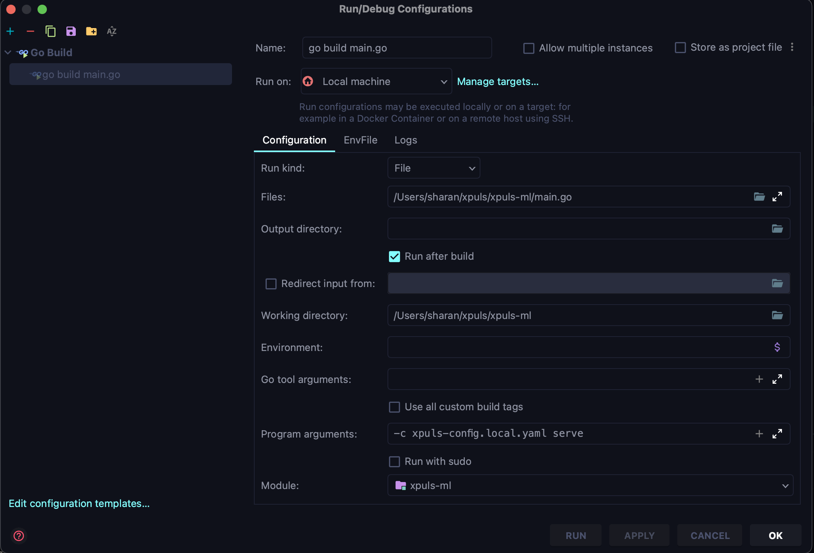

# Developer's Guide to Setting up Xpuls AI in Local Machine

## Server Setup
1. Install `golang` in your machine
2. Setup postgreSQL server in your machine, and create a new database for the xpuls
   1. Grant following permissions to the user
```postgresql
    create user xpuls_client with password '<password>';
    create database xpuls;

    -- Grant required permissions
    grant all privileges on database xpuls to xpuls_client;
    grant all privileges on all tables in schema public to xpuls_client;
    grant all privileges on all sequences in schema public to xpuls_client;
    grant all privileges on all procedures in schema public to xpuls_client;
    grant all privileges on schema public to xpuls_client;

```
   2. Copy xpuls-config.yaml to create xpuls-config.local.yaml
   3. Update the postgresDB credentials
3. For compiling go: `go build main.go`
   1. If you are using an jetbrains IDE, then you can directly run the main.go through that as shown below
   

4. For running the server using the below command
 ```shell
    ./main -c xpuls-config.local.yaml serve
    # This spins up the server on port 8000
```

## UI Setup
All the UI code is present in /ui directory
1. Install `node >= 20.5` on your machine
2. Install `yarn`
3. Perform `yarn install` to setup dependencies
4. Then run `yarn dev` which spins up UI at port `3000`


## How to add database migrations?
TDB - to add
